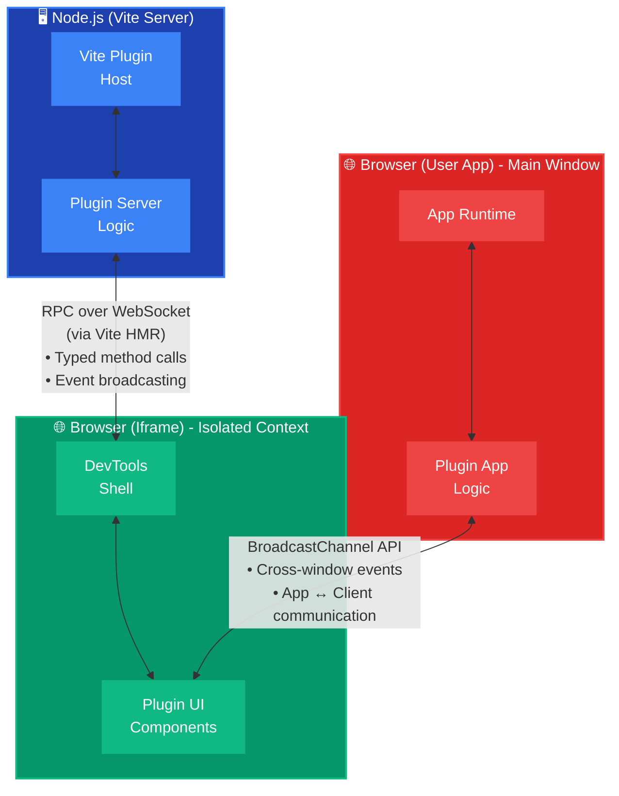

# 🛠️ Universal DevTools Kit

[](https://www.npmjs.com/package/@u-devtools/core)
[](https://www.npmjs.com/package/@u-devtools/core)
[](https://www.npmjs.com/package/@u-devtools/core)
[](https://www.typescriptlang.org/)
[](https://github.com/s00d/u-devtools)
[](https://www.donationalerts.com/r/s00d88)

> A comprehensive framework for building custom DevTools tailored to your specific needs.

## 📹 Preview

[](https://www.youtube.com/watch?v=e48xwfp9W-0 "Universal DevTools Kit Preview")

*Click the image above to watch the demo video*

## What is Universal DevTools Kit?

**Universal DevTools Kit is not a ready-made DevTools solution.** Instead, it's a **comprehensive framework and toolkit** for building your own custom DevTools tailored to your specific needs.

This kit provides you with:
- A complete architecture for running code in three execution contexts (Server, Client, App)
- Pre-built UI components and APIs
- Communication bridges between contexts
- Plugin system for extensibility
- Everything you need to create professional debugging tools

### Why Build Custom DevTools?

Unlike framework-specific tools (like Vue DevTools or React DevTools), Universal DevTools Kit allows you to:

- **Build tools that work across any framework** - Vue, React, Svelte, Lit, or Vanilla JS
- **Create domain-specific debuggers** - Custom tools for your design system, state management, or business logic
- **Integrate file system operations** - Build browser-based editors for config files, translations, or any project files
- **Unify your development experience** - Create a single DevTools interface for your entire tech stack
- **Full control over features** - Build exactly what you need, nothing more, nothing less

### Three Execution Contexts

Universal DevTools Kit operates in three distinct execution contexts, each serving a specific purpose:

1. **Server (Node.js)** - Runs in your Vite dev server
   - Access to file system
   - Read/write project files
   - Access Vite configuration
   - Database connections
   - Terminal commands

2. **Client (Vue 3 iframe)** - Runs in an isolated iframe
   - Plugin UI rendering
   - Settings management
   - Command palette
   - Visualizations and panels

3. **App (Window)** - Runs in your application's main window
   - DOM inspection and manipulation
   - Network request interception
   - Access to global `window` objects
   - Runtime state inspection
   - Event monitoring

### Use Cases

- **Design System Debugger** - Inspect component props, theme values, and design tokens
- **Translation Editor** - Visual editor for i18n files with live preview
- **State Inspector** - Monitor and modify application state across frameworks
- **API Debugger** - Intercept and replay network requests
- **Performance Profiler** - Track render times, memory usage, and bundle analysis
- **Custom Business Logic Tools** - Build tools specific to your application's domain

## ✨ Features

- ⚡️ **Framework Agnostic:** Build DevTools that work with Vue, React, Svelte, Lit, or Vanilla JS
- 🔌 **Three Execution Contexts:** Run code in Server (Node.js), Client (Vue 3 iframe), and App (main window)
- 🌉 **Robust Communication:** Typed RPC over WebSocket (Server ↔ Client) and BroadcastChannel (App ↔ Client)
- 🎨 **Complete UI Kit:** 20+ pre-built components with dark theme support
- ⌨️ **Developer Experience:** Command Palette, persistent storage, settings management, keyboard shortcuts
- 📦 **Zero Config:** Auto-injects into your Vite project - no manual setup required
- 🔧 **TypeScript First:** Full TypeScript support with comprehensive type definitions
- 🎯 **Plugin System:** Extensible architecture with isolated plugin contexts
- 🛠️ **Overlay Menu API:** Add custom buttons to the DevTools launcher
- 📚 **Comprehensive Documentation:** Step-by-step guides and examples

## 🚀 Installation & Quick Start

### Step 1: Install Dependencies

Install the Universal DevTools Kit core package and plugins:

```bash
# Using npm
npm install -D @u-devtools/vite @u-devtools/client @u-devtools/overlay

# Using pnpm (recommended)
pnpm add -D @u-devtools/vite @u-devtools/client @u-devtools/overlay

# Using yarn
yarn add -D @u-devtools/vite @u-devtools/client @u-devtools/overlay
```

### Step 2: Install Plugins (Optional)

Install the plugins you want to use:

```bash
# Using npm
npm install -D \
  @u-devtools/plugin-i18n@latest \
  @u-devtools/plugin-network@latest \
  @u-devtools/plugin-inspector@latest \
  @u-devtools/plugin-terminal@latest \
  @u-devtools/plugin-storage@latest \
  @u-devtools/plugin-package-inspector@latest \
  @u-devtools/plugin-vue-inspector@latest \
  @u-devtools/plugin-vite-inspector@latest

# Using pnpm (recommended)
pnpm add -D \
  @u-devtools/plugin-i18n@latest \
  @u-devtools/plugin-network@latest \
  @u-devtools/plugin-inspector@latest \
  @u-devtools/plugin-terminal@latest \
  @u-devtools/plugin-storage@latest \
  @u-devtools/plugin-package-inspector@latest \
  @u-devtools/plugin-vue-inspector@latest \
  @u-devtools/plugin-vite-inspector@latest

# Using yarn
yarn add -D \
  @u-devtools/plugin-i18n@latest \
  @u-devtools/plugin-network@latest \
  @u-devtools/plugin-inspector@latest \
  @u-devtools/plugin-terminal@latest \
  @u-devtools/plugin-storage@latest \
  @u-devtools/plugin-package-inspector@latest \
  @u-devtools/plugin-vue-inspector@latest \
  @u-devtools/plugin-vite-inspector@latest
```

### Step 3: Configure Vite

Add the DevTools plugin to your `vite.config.ts`:

```ts
import { defineConfig } from 'vite';
import vue from '@vitejs/plugin-vue';
import { createDevTools } from '@u-devtools/vite';
import { plugin as i18nPlugin } from '@u-devtools/plugin-i18n';
import { plugin as networkPlugin } from '@u-devtools/plugin-network';
import { plugin as inspectorPlugin } from '@u-devtools/plugin-inspector';
import { plugin as terminalPlugin } from '@u-devtools/plugin-terminal';
import { plugin as storagePlugin } from '@u-devtools/plugin-storage';
import { plugin as packageInspectorPlugin } from '@u-devtools/plugin-package-inspector';
import { plugin as vueInspectorPlugin } from '@u-devtools/plugin-vue-inspector';
import { plugin as viteInspectorPlugin } from '@u-devtools/plugin-vite-inspector';

import path from 'node:path';
import { fileURLToPath } from 'node:url';

const __dirname = path.dirname(fileURLToPath(import.meta.url));

export default defineConfig({
  plugins: [
    vue(),
    createDevTools({
      // Base path for DevTools UI (in iframe)
      base: '/__devtools',
      plugins: [
        // i18n plugin: looks in src/locales directory
        i18nPlugin({ dir: 'src/locales' }),

        // Network plugin: intercepts fetch/xhr
        networkPlugin(),

        // Inspector plugin: allows selecting elements
        inspectorPlugin(),

        // Terminal plugin: full terminal with support for any commands
        terminalPlugin(),

        // Storage plugin: view LocalStorage/SessionStorage/Cookies
        storagePlugin(),

        // Package inspector plugin: view dependencies
        packageInspectorPlugin(),

        // Vue Inspector plugin: route inspector (Vue-specific)
        vueInspectorPlugin(),

        // Vite Inspector plugin: Vite diagnostics and management
        viteInspectorPlugin(),
      ],
    }),
  ],
  resolve: {
    // IMPORTANT: Deduplicate Vue to prevent duplicate instances in monorepo
    dedupe: ['vue'],
    alias: {
      '@': path.resolve(__dirname, './src'),
    },
  },
  server: {
    // IMPORTANT: File system access configuration
    // Vite requires explicit permission to access files outside the project root.
    // DevTools plugins (like i18n) need to read/write files in your project,
    // so we need to grant access to the project directory.
    fs: {
      allow: [__dirname],
    },
    // Optional: Enable polling for file watching (useful in some environments)
    watch: {
      usePolling: true,
    },
  },
});
```

**Important Configuration Notes:**

- **`server.fs.allow`**: Vite requires explicit permission to access files outside the project root. Since DevTools plugins (like the i18n plugin) need to read and write files in your project directory, you must grant access using `fs.allow: [__dirname]`. This allows plugins to perform file system operations safely.

- **`server.watch.usePolling`**: Optional setting that enables polling-based file watching. This is useful in certain environments (like Docker, WSL, or network file systems) where native file system events may not work reliably. You can omit this if your environment supports native file watching.

### Step 4: Run Your Dev Server

Start your development server:

```bash
npm run dev
# or
pnpm dev
# or
yarn dev
```

You'll see a floating DevTools button (🛠️) in the bottom-right corner of your application. Click it to open the DevTools panel!

### Step 5: Create Your Own Plugin (Optional)

The easiest way to create a plugin is using the built-in generator:

#### Option A: Using the Generator (Recommended)

From the root of your project (or monorepo):

```bash
# In monorepo
pnpm create:plugin

# Or if published as npm package
npm create u-devtools@latest
```

The generator will ask you:
- **Project folder name** - Where to create the plugin (e.g., `plugins/my-feature`)
- **Plugin display name** - Name shown in DevTools (e.g., `My Feature`)
- **Package name** - Package name in package.json (e.g., `@u-devtools/plugin-my-feature`)
- **Description** - Plugin description
- **Features to include** - Select which features to scaffold:
  - ✅ Settings Schema (default)
  - ✅ Command Palette Commands (default)
  - ⬜ Sidebar Panel
  - ⬜ Overlay Menu Item
  - ✅ File System Operations (default)
  - ✅ App Context Communication (default)

The generator supports multiple framework templates (Vue, React, Solid, Svelte, Vanilla JS, Lit) and creates a complete plugin structure with framework-specific components and examples for all selected features!

#### Option B: Manual Creation

If you prefer to create a plugin manually, see the [Plugin Development Guide](#4-plugin-development-guide) section.

### Next Steps

Now that you have DevTools set up, you can:
- Explore the built-in plugins in the DevTools panel
- Create your own custom plugins
- Read the documentation site for detailed guides and examples
- Check out the API Reference for all interfaces and classes
- See the Plugin Development Guide in the documentation

**📚 For detailed documentation, examples, and API reference:**
- **Documentation Site** - Complete guides and tutorials (run `pnpm docs:dev` to view locally)
- **API Reference** - All TypeScript interfaces and classes (auto-generated)
- **Getting Started Guide** - Quick start tutorial

## 3. Architecture Deep Dive

Understanding the architecture is crucial for building effective plugins. Universal DevTools Kit uses a three-context architecture with specialized communication channels.

### Architecture Overview



### Execution Contexts Explained

#### 1. Server Context (Node.js)

**Location:** Runs inside your Vite dev server process

**Capabilities:**
- Full file system access (read/write project files)
- Access to Vite configuration and dev server instance
- Execute terminal commands
- Database connections
- Package management operations
- File watching and hot reloading

**When to use:**
- Reading or modifying project files
- Executing build commands
- Accessing server-side resources
- File system operations

**Communication:**
- Receives RPC calls from Client via WebSocket
- Can broadcast events to all connected clients
- Uses `RpcServerInterface` for method registration

#### 2. Client Context (Vue 3 iframe)

**Location:** Runs in an isolated iframe, separate from your application

**Capabilities:**
- Render plugin UI using Vue 3 (or any framework via mount adapters)
- Access to DevTools shell APIs (storage, settings, notifications)
- Command Palette integration
- Settings management UI
- Visualizations and data display

**When to use:**
- Building plugin user interfaces
- Displaying data from Server or App
- User interactions and form handling
- Settings and configuration UI

**Communication:**
- Calls Server methods via RPC
- Receives events from Server via RPC
- Communicates with App via BroadcastChannel
- Uses `ClientApi` for all operations

#### 3. App Context (Main Window)

**Location:** Scripts injected into your application's main window

**Capabilities:**
- DOM inspection and manipulation
- Network request interception (fetch, XHR)
- Access to global `window` objects
- Runtime state inspection
- Event monitoring and patching
- Overlay UI elements

**When to use:**
- Inspecting DOM elements
- Intercepting network requests
- Monitoring application events
- Accessing framework internals
- Creating overlay UI

**Communication:**
- Communicates with Client via BroadcastChannel
- Uses `AppBridge` for structured communication
- Can register overlay menu items declaratively

### Communication Patterns

#### Server ↔ Client: RPC over WebSocket

The Server and Client communicate using Remote Procedure Calls (RPC) over WebSocket, leveraging Vite's HMR connection.

**Server side:**
```ts
// Register a method
rpc.handle('my-plugin:read-file', async (path: string) => {
  return await fs.readFile(path, 'utf-8');
});

// Broadcast an event
rpc.broadcast('my-plugin:file-changed', { path, content });
```

**Client side:**
```ts
// Call a method
const content = await api.rpc.call('my-plugin:read-file', '/path/to/file');

// Listen for events
api.rpc.on('my-plugin:file-changed', (data) => {
  console.log('File changed:', data);
});
```

#### App ↔ Client: BroadcastChannel

The App and Client communicate using the BroadcastChannel API, which allows cross-window communication.

**App side:**
```ts
import { defineApp } from '@u-devtools/kit';

export default defineApp({
  setup({ bridge }) {
    bridge.send('element-selected', { id: 'my-element' });
  },
});
```

**Client side:**
```ts
bridge.on('element-selected', (data) => {
  console.log('Element selected:', data);
});
```

### Data Flow Example

Here's how data flows through the three contexts in a typical scenario:

1. **User clicks a button in Client UI** → Triggers RPC call to Server
2. **Server reads file from disk** → Returns data to Client
3. **Client displays data** → User interacts with it
4. **Client sends command to App** → Via BroadcastChannel
5. **App modifies DOM** → Sends result back to Client
6. **Client updates UI** → Shows updated state

This architecture ensures:
- **Isolation:** Client UI doesn't interfere with your app
- **Security:** Server operations are sandboxed
- **Performance:** Each context runs in its optimal environment
- **Flexibility:** You can use any framework or library in each context

### Typed RPC Communication

Universal DevTools Kit provides fully typed RPC communication between App and Client contexts using Protocol-based typing.

**Define your Protocol:**

```ts
// src/types.ts
export interface MyPluginProtocol {
  // Events sent from App to Client
  'element-selected': (data: { id: string; html: string }) => void;
  'inspector-active': (data: { active: boolean }) => void;

  // Events sent from Client to App
  'toggle-inspector': (data: { state: boolean }) => void;
  'update-classes': (data: { udtId: string; classes: string[] }) => void;
}
```

**Use typed bridge:**

```ts
// src/app.ts
import { defineApp } from '@u-devtools/kit';
import type { AppBridge } from '@u-devtools/core';
import type { MyPluginProtocol } from './types';

export default defineApp({
  setup({ bridge, onCleanup }) {
    const typedBridge = bridge as AppBridge<MyPluginProtocol>;
    
    // ✅ Full type safety and autocompletion
    typedBridge.send('element-selected', { id: 'el-1', html: '<div>...</div>' });
    
    // ✅ Typed event handlers
    typedBridge.on('toggle-inspector', ({ state }) => {
      // state is automatically typed as { state: boolean }
      console.log('Inspector toggled:', state);
    });
  },
});
```

**Benefits:**
- ✅ Full TypeScript autocompletion for event names
- ✅ Type checking for payloads at compile time
- ✅ No runtime errors from typos in event names
- ✅ Self-documenting code

### SyncedState - Universal State Synchronization

`SyncedState` is a universal state management class that synchronizes state between App and Client contexts. It works with any framework and is compatible with React's `useSyncExternalStore`.

**Create SyncedState:**

```ts
// src/app.ts
import { defineApp } from '@u-devtools/kit';
import type { AppBridge } from '@u-devtools/core';

export default defineApp({
  setup({ bridge }) {
    // Create synced state
    const isOpen = bridge.state('isOpen', false);
    
    // Read value
    console.log(isOpen.value); // false
    
    // Update value (automatically syncs to Client)
    isOpen.value = true;
    
    // Subscribe to changes
    const unsub = isOpen.subscribe((val) => {
      console.log('State changed:', val);
    });
    
    // Cleanup
    onCleanup(() => unsub());
  },
});
```

**Use in Vue (with adapter):**

```ts
// src/client.ts or component
import { useBridgeState } from '@u-devtools/kit/vue';
import { useBridge } from './context';

const bridge = useBridge();
const isOpen = bridge.state('isOpen', false);

// Convert to Vue ref
const isOpenRef = useBridgeState(isOpen);

// Now use as normal Vue ref
watch(isOpenRef, (val) => {
  console.log('Vue reactive:', val);
});
```

**Use in React (with useSyncExternalStore):**

```ts
// src/store.ts
import { AppBridge } from '@u-devtools/core';
import type { MyPluginProtocol } from './types';

const bridge = new AppBridge<MyPluginProtocol>('my-plugin');
export const isOpen = bridge.state('isOpen', false);
```

```tsx
// rc/components/Toggle.tsx
import { useSyncExternalStore } from 'react';
import { isOpen } from '../store';

export const Toggle = () => {
  const enabled = useSyncExternalStore(
    isOpen.subscribe,
    isOpen.getSnapshot
  );

  return (
    <button onClick={() => isOpen.value = !enabled}>
      Inspector is: {enabled ? 'ON' : 'OFF'}
    </button>
  );
};
```

**Use in Vanilla JS:**

```ts
const isOpen = bridge.state('isOpen', false);

// Subscribe
const unsub = isOpen.subscribe((val) => {
  document.getElementById('status').innerText = val ? 'Open' : 'Closed';
});

// Update
document.getElementById('toggle').onclick = () => {
  isOpen.value = !isOpen.value;
};
```

**Key Features:**
- ✅ Framework-agnostic (works with Vue, React, Svelte, Vanilla JS)
- ✅ Automatic synchronization between App and Client
- ✅ Compatible with React `useSyncExternalStore`
- ✅ Observer pattern implementation
- ✅ Type-safe with TypeScript

## 📚 Documentation

The documentation site is built with [VitePress](https://vitepress.dev/) and includes:

- **Guides**: Step-by-step tutorials and best practices
- **API Reference**: Auto-generated from TypeScript code using [TypeDoc](https://typedoc.org/)
- **Examples**: Real-world plugin examples and use cases

### Running Documentation Locally

```bash
# Start development server (generates API docs and starts VitePress)
pnpm docs:dev

# Build for production
pnpm docs:build

# Preview production build
pnpm docs:preview
```

The documentation will be available at `http://localhost:5173` (or the port shown in terminal).

### API Documentation

Complete TypeScript API documentation is automatically generated from code using [TypeDoc](https://typedoc.org/). All interfaces, classes, and methods include JSDoc comments with descriptions, parameters, and examples.


## 🤝 Contributing

This project is a monorepo managed by pnpm.

1. Clone the repository:
   ```bash
   git clone https://github.com/s00d/u-devtools.git
   cd u-devtools
   ```
2. Install dependencies: `pnpm install`.
3. Build packages: `pnpm build`.
4. Run the playground: `cd playground && pnpm dev`.

### Testing

We use Vitest for testing the core logic and bridge.

```bash
pnpm test
```

## 📄 License

MIT License © 2025-present.
