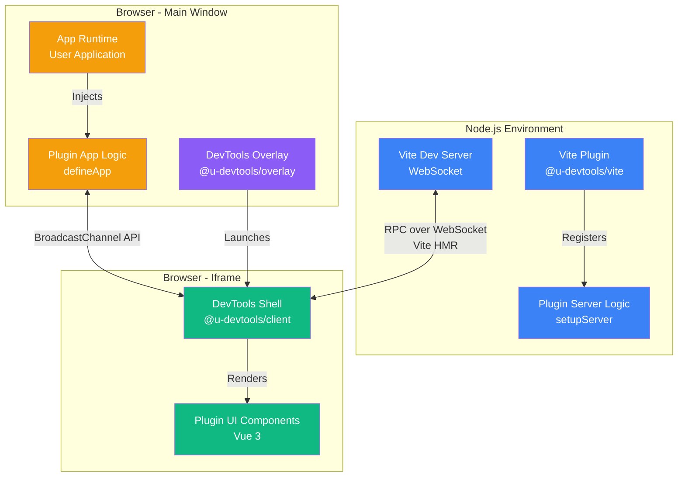
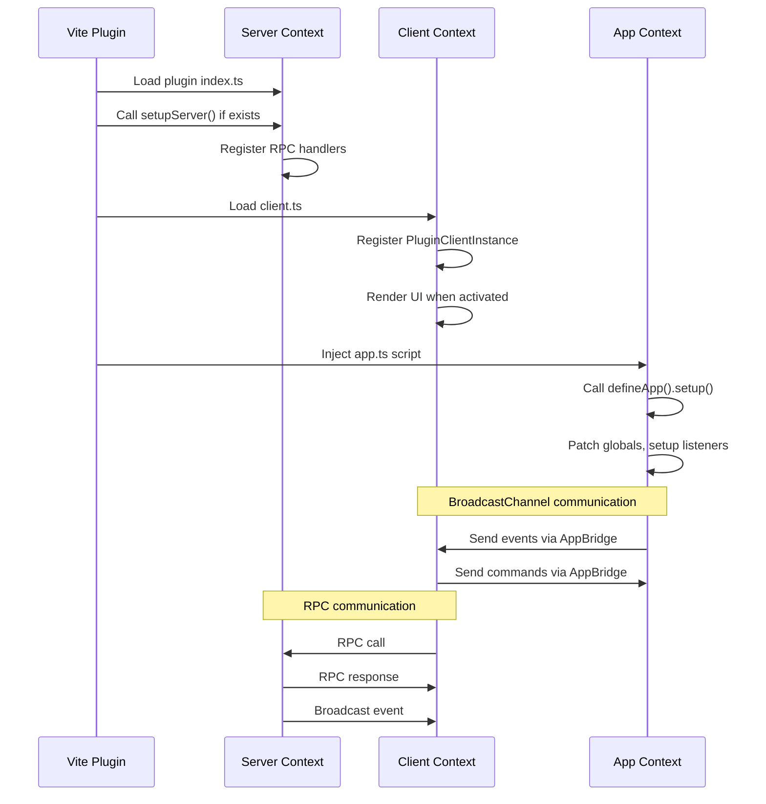
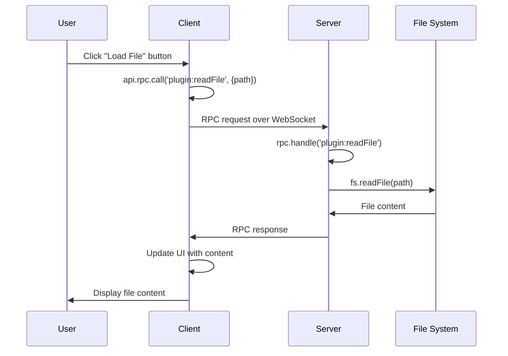
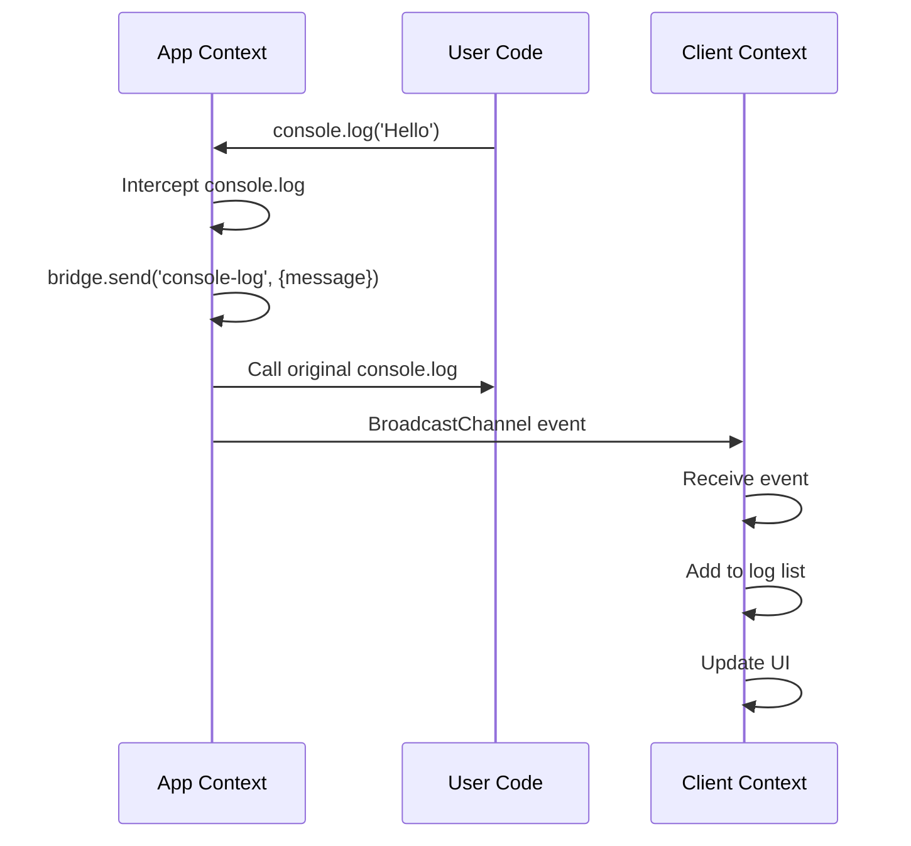

# Architecture

Universal DevTools Kit is a framework-agnostic system for building custom developer tools. The project consists of three main layers that work together to provide a complete DevTools experience.

## Overview



## Three Execution Contexts

### 1. Server (Node.js)

Runs in your Vite dev server process with full Node.js capabilities:

**Capabilities:**
- File system operations (read/write files)
- Vite configuration access
- Database connections
- Terminal command execution
- Package management
- Process management

**Location:** `packages/vite/src/index.ts` - Vite plugin that sets up the server context

**Key Components:**
- `ViteRpcServer` - Handles RPC requests from client
- `ServerContext` - Provides root path and Vite server instance
- Plugin `setupServer()` functions - Register RPC handlers

**Example:**
```typescript
// server.ts
export function setupServer(rpc: RpcServerInterface, ctx: ServerContext) {
  const fs = new FileSystemService(ctx.root);
  
  rpc.handle('my-plugin:readFile', async (payload) => {
    const { path } = payload as { path: string };
    return await fs.read(path);
  });
}
```

### 2. Client (Vue 3 Iframe)

Isolated Vue 3 application running in an iframe for the DevTools UI:

**Capabilities:**
- Plugin UI rendering
- State management (Pinia)
- User interactions
- Settings and storage management
- Command palette
- Plugin management

**Location:** `packages/client/` - Complete Vue 3 application

**Key Components:**
- `ActivityBar` - Left sidebar with plugin icons (VS Code style)
- `MainView` - Main content area for plugin panels
- `PluginSidebar` - Right sidebar for plugin-specific content
- `CommandPalette` - Command search (Ctrl+K / Cmd+K)
- `PluginRenderer` - Renders plugin UI components

**API Available to Plugins:**
```typescript
interface ClientApi {
  rpc: RpcClientInterface;        // RPC calls to server
  notify: (msg, type) => void;    // Show notifications
  storage: StorageApi;             // Isolated plugin storage
  settings: SettingsApi;            // Plugin settings
  shortcuts: ShortcutApi;          // Keyboard shortcuts
  clipboard: ClipboardApi;         // Clipboard operations
  bus: EventBusApi;                // Inter-plugin communication
  dialog: DialogApi;               // Dialogs (confirm/prompt)
  navigation: NavigationApi;       // Navigate between plugins
}
```

### 3. App (Main Window)

Scripts injected into the user's application main window:

**Capabilities:**
- DOM inspection and manipulation
- Network request interception
- Global object patching (console, fetch, XMLHttpRequest)
- Runtime state inspection
- Event monitoring
- Overlay components

**Location:** Plugin `app.ts` files - Injected via `<script>` tag

**Key Features:**
- `AppBridge` - Communication bridge to client
- `defineApp()` - Helper for app context setup
- HMR cleanup - Restore patches on hot reload

**Example:**
```typescript
// app.ts
import { defineApp } from '@u-devtools/kit';

export default defineApp({
  setup({ bridge, onCleanup }) {
    // Patch console
    const originalLog = console.log;
    console.log = (...args) => {
      bridge.send('console-log', { args });
      originalLog.apply(console, args);
    };
    
    // Cleanup on HMR
    onCleanup(() => {
      console.log = originalLog;
    });
  }
});
```

## Communication Channels

### Server ↔ Client: RPC over WebSocket

**Protocol:** Custom RPC protocol over Vite HMR WebSocket

**Implementation:**
- **Client Side:** `ViteRpcClient` from `@u-devtools/bridge`
- **Server Side:** `ViteRpcServer` from `@u-devtools/bridge`

**Features:**
- Bidirectional communication
- Type-safe with TypeScript
- Request/response pattern
- Event broadcasting
- Automatic reconnection

**Message Format:**
```typescript
// Request
{
  id: string;
  method: string;
  payload?: unknown;
}

// Response
{
  id: string;
  result?: unknown;
  error?: string;
}

// Event (broadcast)
{
  event: string;
  payload?: unknown;
}
```

**Example:**
```typescript
// Client → Server
const result = await api.rpc.call('my-plugin:method', { data: 'value' });

// Server → Client (broadcast)
rpc.broadcast('my-plugin:update', { data: 'new value' });

// Client listens
api.rpc.on('my-plugin:update', (data) => {
  console.log('Update received:', data);
});
```

### App ↔ Client: BroadcastChannel API

**Protocol:** Browser BroadcastChannel API for cross-window communication

**Implementation:**
- `AppBridge` class from `@u-devtools/core`
- Uses namespace-based channels

**Features:**
- Event-based communication (no RPC)
- Works across iframes and windows
- Automatic cleanup
- Type-safe with TypeScript protocols

**Example:**
```typescript
// App context
const bridge = new AppBridge<MyProtocol>('my-plugin');
bridge.send('event-name', { data: 'value' });

// Client context
const bridge = new AppBridge<MyProtocol>('my-plugin');
bridge.on('event-name', (data) => {
  console.log('Event received:', data);
});
```

## SDK Packages

### Core Packages

#### `@u-devtools/core`
**Purpose:** Core interfaces, types, and base classes

**Key Exports:**
- `DevToolsPlugin` - Plugin definition interface
- `PluginClientInstance` - Client UI definition
- `ClientApi` - API available to plugins
- `RpcClientInterface` / `RpcServerInterface` - RPC interfaces
- `AppBridge` - App ↔ Client communication
- `SyncedState` - State synchronization between contexts
- `StorageApi` / `SettingsApi` - Storage and settings APIs

**Location:** `packages/core/`

#### `@u-devtools/bridge`
**Purpose:** RPC bridge implementation for Server ↔ Client communication

**Key Exports:**
- `ViteRpcClient` - Client-side RPC implementation
- `ViteRpcServer` - Server-side RPC implementation

**Location:** `packages/bridge/`

#### `@u-devtools/kit`
**Purpose:** SDK for creating plugins with helper functions

**Key Exports:**
- `definePlugin()` - Plugin factory helper
- `defineApp()` - App context helper
- `defineVueElement()` - Web Components helper
- Framework adapters (Vue, React, Svelte, Solid, Lit)

**Location:** `packages/kit/`

### UI & Client Packages

#### `@u-devtools/ui`
**Purpose:** Reusable Vue 3 component library

**Key Components:**
- Form inputs (UInput, USelect, UTextarea, UDropdown)
- Layout (UCard, USplitter, UTabs, UAccordion)
- Data display (UTable, UTreeView, UJsonTree, UKeyValue)
- Feedback (UModal, ULoading, UEmpty, UBadge)
- Code (UCodeBlock)
- Utilities (UIcon, UPluginLayout)

**Location:** `packages/ui/`

#### `@u-devtools/client`
**Purpose:** DevTools shell application (Vue 3)

**Structure:**
```
packages/client/src/
├── App.vue                    # Root component
├── main.ts                    # Entry point
├── components/
│   ├── shell/                 # Shell components
│   │   ├── ActivityBar.vue    # Left sidebar
│   │   ├── MainView.vue        # Main content
│   │   └── PluginSidebar.vue  # Right sidebar
│   ├── CommandPalette.vue     # Command search
│   ├── PluginManager.vue      # Plugin management
│   └── PluginRenderer.vue     # Plugin renderer
├── composables/               # Vue composables
│   ├── useDevToolsState.ts    # Global state
│   ├── useNotifications.ts    # Notifications
│   └── useSettings.ts         # Settings
└── modules/                   # API modules
    ├── clientApi.ts           # ClientApi factory
    ├── settings.ts            # Settings API
    └── shortcuts.ts           # Keyboard shortcuts
```

**Location:** `packages/client/`

#### `@u-devtools/overlay`
**Purpose:** DevTools overlay launcher and menu

**Features:**
- Floating launcher button
- Overlay menu with plugin shortcuts
- Toast notifications
- Position management

**Location:** `packages/overlay/`

### Integration Packages

#### `@u-devtools/vite`
**Purpose:** Vite plugin integration

**What it does:**
1. Creates virtual modules for plugins
2. Sets up RPC server via WebSocket
3. Injects DevTools UI iframe
4. Injects plugin app scripts
5. Registers system RPC methods

**Virtual Modules:**
- `virtual:u-devtools-plugins` - Imports all client.ts files
- `virtual:u-devtools-app` - Injects all app.ts scripts

**Location:** `packages/vite/`

### Utility Packages

#### `@u-devtools/utils`
**Purpose:** Browser utility functions

**Exports:**
- Color utilities
- Format utilities
- JSON utilities
- Path utilities
- Serialization utilities

**Location:** `packages/utils/`

#### `@u-devtools/utils-node`
**Purpose:** Node.js utility functions

**Exports:**
- `FileSystemService` - File system operations
- `PackageManager` - Package management utilities
- Path utilities

**Location:** `packages/utils-node/`

## Plugin Architecture

### Plugin Structure

Each plugin follows a consistent structure:

```
my-plugin/
├── package.json
├── src/
│   ├── index.ts          # Plugin definition (definePlugin)
│   ├── server.ts         # (Optional) Server logic
│   ├── client.ts         # Client UI definition
│   ├── app.ts            # (Optional) App context logic
│   └── ui/               # Vue components
│       └── MyPanel.vue
```

### Plugin Definition

Plugins are defined using the `definePlugin` helper:

```typescript
// src/index.ts
import { definePlugin } from '@u-devtools/kit/define-plugin';

export default definePlugin({
  name: 'My Plugin',
  root: import.meta.url,  // Required for path resolution
  client: './client',      // Path to client.ts
  app: './app',            // Optional: path to app.ts
  server: './server',     // Optional: path to server.ts
  meta: {
    name: '@u-devtools/plugin-my-plugin',
    version: '1.0.0',
    description: 'My custom plugin'
  }
});
```

### Plugin Lifecycle



## Data Flow

### Example: Reading a File



### Example: Console Log Interception



## Virtual Modules

The Vite plugin creates virtual modules for dynamic plugin loading:

### `virtual:u-devtools-plugins`

Dynamically imports all plugin `client.ts` files:

```typescript
// Generated by Vite plugin
export const plugins = [
  import('./plugins/console/src/client.ts'),
  import('./plugins/network/src/client.ts'),
  // ... all plugins
];
```

**Usage in Client:**
```typescript
import { plugins } from 'virtual:u-devtools-plugins';
// plugins is PluginClientInstance[]
```

### `virtual:u-devtools-app`

Injects all plugin `app.ts` scripts into the main window:

```html
<!-- Injected into index.html -->
<script type="module" src="virtual:u-devtools-app"></script>
```

**Generated content:**
```typescript
// Dynamically imports all app.ts files
import './plugins/console/src/app.ts';
import './plugins/network/src/app.ts';
// ... all plugins
```

## System RPC Methods

The Vite plugin registers system RPC methods available to all plugins:

### `sys:getPlugins`
Get list of all registered plugins.

### `sys:openFile`
Open a file in the editor (VS Code, WebStorm, etc.):
```typescript
await api.rpc.call('sys:openFile', {
  file: 'src/App.vue',
  line: 10,
  column: 5
});
```

### `sys:plugins:list`
Get plugins list for plugin manager.

### `sys:plugins:search`
Search for plugins in NPM registry.

### `sys:plugins:install`
Install a plugin from NPM.

### `sys:plugins:uninstall`
Uninstall a plugin.

## Storage & Settings Isolation

Each plugin has isolated storage and settings:

**Storage Scope:**
- Key format: `{pluginName}:{key}`
- Example: `console:lastView` → `console:list`

**Settings Scope:**
- Key format: `{pluginName}:{key}`
- Example: `network:preserveLog` → `network:true`

**Benefits:**
- No conflicts between plugins
- Automatic cleanup on plugin removal
- Type-safe access

## Best Practices

### 1. HMR Cleanup

Always restore patches in `app.ts`:

```typescript
if (import.meta.hot) {
  import.meta.hot.dispose(() => {
    // Restore original functions
    window.fetch = originalFetch;
    // Remove listeners
    document.removeEventListener('click', handler);
    // Close bridge
    bridge.close();
  });
}
```

### 2. Error Handling

Always handle errors in RPC calls:

```typescript
try {
  const result = await api.rpc.call('method', payload);
} catch (error) {
  api.notify(`Error: ${error}`, 'error');
}
```

### 3. Type Safety

Define protocols for type-safe communication:

```typescript
interface MyPluginProtocol {
  'my-plugin:event': { data: string };
}

const bridge = new AppBridge<MyPluginProtocol>('my-plugin');
```

### 4. Resource Cleanup

Return cleanup functions from render methods:

```typescript
renderMain(container, api) {
  const app = createApp(MyPanel);
  app.mount(container);
  return () => {
    app.unmount();
    // Additional cleanup
  };
}
```

## Next Steps

- Learn how to [create plugins](./plugin-development.md)
- Explore [UI components](./components.md)
- Check the [API Reference](../api/@u-devtools/core/README)
