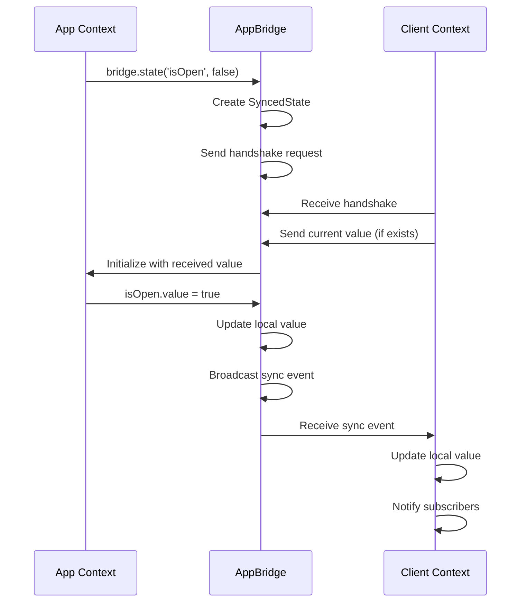

# Plugin Development

Learn how to create plugins for Universal DevTools Kit.

## Overview

Universal DevTools Kit plugins run in **three separate execution contexts**:

1. **Server Context** (Node.js) - Runs in Vite dev server, has access to file system, databases, etc.
2. **Client Context** (Vue 3 iframe) - The DevTools UI panel, where users interact with your plugin
3. **App Context** (Main window) - Runs on the user's page, can intercept console, network, DOM, etc.

These contexts communicate via RPC (Remote Procedure Calls) and message passing.

## Plugin Structure

A plugin is defined using `definePlugin` helper:

```typescript
// src/index.ts
import { definePlugin } from '@u-devtools/kit/define-plugin';

export default definePlugin({
  name: 'My Plugin',
  root: import.meta.url,  // Required: pass import.meta.url for path resolution
  client: './client',      // Optional: path to client.ts (defaults to './client')
  app: './app',            // Optional: path to app.ts
  server: './server',      // Optional: path to server.ts (defaults to './server')
  meta: {                  // Optional: plugin metadata
    name: '@my-org/my-plugin',
    version: '1.0.0',
    description: 'My custom DevTools plugin'
  }
});
```

### Important Notes

- **`root` is required**: Must be `import.meta.url` so the helper can resolve relative paths correctly
- **Paths are relative**: All paths (`client`, `app`, `server`) are relative to the file where `definePlugin` is called
- **Null to disable**: Pass `null` to disable loading a context (e.g., `server: null` if you don't need server-side logic)
- **Auto-loading**: If `server` path is specified, the server file will be automatically loaded and its `setupServer` export will be called

## Server Context (server.ts)

The server context runs in Node.js and has access to the file system, databases, and other Node.js APIs. This is where you implement RPC handlers that the client can call.

```typescript
// src/server.ts
import type { RpcServerInterface, ServerContext } from '@u-devtools/core';
import { FileSystemService } from '@u-devtools/utils-node';
import * as path from 'node:path';

export function setupServer(rpc: RpcServerInterface, ctx: ServerContext) {
  const fs = new FileSystemService(ctx.root);

  // Register RPC handler
  rpc.handle('my-plugin:getData', async () => {
    // Read files, query databases, etc.
    const data = await fs.readJson('data.json');
    return data;
  });

  // RPC handler with parameters
  rpc.handle('my-plugin:saveData', async (payload: unknown) => {
    const { file, content } = payload as { file: string; content: unknown };
    await fs.writeJson(file, content);
    
    // Broadcast update to all connected clients
    rpc.broadcast('my-plugin:dataUpdated', { file, content });
    
    return { success: true };
  });

  // RPC handler that uses server context
  rpc.handle('my-plugin:readFile', async (payload: unknown) => {
    const { filePath } = payload as { filePath: string };
    const fullPath = path.resolve(ctx.root, filePath);
    return await fs.read(fullPath);
  });
}
```

### RPC Payload Validation with Zod

Universal DevTools Kit uses **Zod** for runtime validation of RPC payloads. This ensures type safety and prevents runtime errors from invalid data.

**Note:** Zod is available through the workspace catalog. Add it to your plugin's `package.json`:

```json
{
  "dependencies": {
    "zod": "catalog:"
  }
}
```

The catalog ensures all plugins use the same Zod version for consistency.

**Why Use Zod Validation?**

- **Type Safety**: Validates payload structure at runtime
- **Error Messages**: Provides clear, detailed validation errors
- **Security**: Prevents invalid data from reaching your handlers
- **Documentation**: Schemas serve as self-documenting API contracts

**Basic Example:**

```typescript
// src/server.ts
import type { RpcServerInterface, ServerContext } from '@u-devtools/core';
import { FileSystemService } from '@u-devtools/utils-node';
import { z } from 'zod';

// Define Zod schema for payload validation
const SaveDataPayloadSchema = z.object({
  file: z.string().min(1, 'file is required'),
  content: z.unknown(),
});

export function setupServer(rpc: RpcServerInterface, ctx: ServerContext) {
  const fs = new FileSystemService(ctx.root);

  // Validate payload with Zod
  rpc.handle('my-plugin:saveData', async (payload: unknown) => {
    // Validate payload structure
    const validationResult = SaveDataPayloadSchema.safeParse(payload);
    if (!validationResult.success) {
      // Return detailed validation errors
      const errors = validationResult.error.issues
        .map((e) => `${e.path.join('.')}: ${e.message}`)
        .join(', ');
      throw new Error(`Validation failed: ${errors}`);
    }
    
    // TypeScript now knows the structure is valid
    const { file, content } = validationResult.data;
    await fs.writeJson(file, content);
    
    rpc.broadcast('my-plugin:dataUpdated', { file, content });
    return { success: true };
  });
}
```

**Organizing Schemas:**

Create a separate `schemas.ts` file for better organization:

```typescript
// src/schemas.ts
import { z } from 'zod';

/**
 * Zod schema for my-plugin:saveData payload
 */
export const SaveDataPayloadSchema = z.object({
  file: z.string().min(1, 'file is required'),
  content: z.unknown(),
});

/**
 * Zod schema for my-plugin:readFile payload
 */
export const ReadFilePayloadSchema = z.object({
  filePath: z.string().min(1, 'filePath is required'),
});

/**
 * Zod schema for my-plugin:updateSettings payload
 */
export const UpdateSettingsPayloadSchema = z.object({
  theme: z.enum(['dark', 'light']),
  fontSize: z.number().min(10).max(24),
  enabled: z.boolean(),
});
```

**Using Schemas in Handlers:**

```typescript
// src/server.ts
import { SaveDataPayloadSchema, ReadFilePayloadSchema } from './schemas';

export function setupServer(rpc: RpcServerInterface, ctx: ServerContext) {
  rpc.handle('my-plugin:saveData', async (payload: unknown) => {
    const validationResult = SaveDataPayloadSchema.safeParse(payload);
    if (!validationResult.success) {
      const errors = validationResult.error.issues
        .map((e) => `${e.path.join('.')}: ${e.message}`)
        .join(', ');
      throw new Error(`Validation failed: ${errors}`);
    }
    const { file, content } = validationResult.data;
    // ... rest of handler
  });
}
```

**Common Zod Patterns:**

```typescript
import { z } from 'zod';

// String with validation
z.string().min(1, 'Required').max(100, 'Too long');

// Number with range
z.number().min(0).max(100);

// Enum
z.enum(['option1', 'option2', 'option3']);

// Optional fields
z.object({
  required: z.string(),
  optional: z.string().optional(),
  withDefault: z.string().default('default value'),
});

// Arrays
z.array(z.string());
z.array(z.object({ id: z.string(), name: z.string() }));

// Nested objects
z.object({
  user: z.object({
    name: z.string(),
    email: z.string().email(),
  }),
});

// Union types
z.union([z.string(), z.number()]);

// Record (key-value pairs)
z.record(z.string(), z.unknown());
```

**Error Handling:**

Zod provides detailed error information:

```typescript
const result = Schema.safeParse(payload);
if (!result.success) {
  // Access validation errors
  result.error.issues.forEach((issue) => {
    console.log('Path:', issue.path);        // ['user', 'email']
    console.log('Message:', issue.message);  // 'Invalid email'
    console.log('Code:', issue.code);        // 'invalid_string'
  });
}
```

**Best Practices:**

1. **Always validate RPC payloads** - Never trust client input
2. **Use descriptive error messages** - Help developers debug issues
3. **Organize schemas** - Keep schemas in a separate `schemas.ts` file
4. **Reuse schemas** - Share common schemas across handlers
5. **Export schemas** - Make schemas available for TypeScript type inference

```typescript
// Export inferred types for use in TypeScript
export type SaveDataPayload = z.infer<typeof SaveDataPayloadSchema>;
```

**Example: Complete Plugin with Validation:**

```typescript
// src/schemas.ts
import { z } from 'zod';

export const SaveFilePayloadSchema = z.object({
  filePath: z.string().min(1, 'filePath is required'),
  content: z.unknown(),
});

export const ReadFilePayloadSchema = z.object({
  filePath: z.string().min(1, 'filePath is required'),
});

// src/server.ts
import type { RpcServerInterface, ServerContext } from '@u-devtools/core';
import { FileSystemService } from '@u-devtools/utils-node';
import { SaveFilePayloadSchema, ReadFilePayloadSchema } from './schemas';

export function setupServer(rpc: RpcServerInterface, ctx: ServerContext) {
  const fs = new FileSystemService(ctx.root);

  rpc.handle('my-plugin:saveFile', async (payload: unknown) => {
    const validationResult = SaveFilePayloadSchema.safeParse(payload);
    if (!validationResult.success) {
      const errors = validationResult.error.issues
        .map((e) => `${e.path.join('.')}: ${e.message}`)
        .join(', ');
      throw new Error(`Validation failed: ${errors}`);
    }
    const { filePath, content } = validationResult.data;
    await fs.writeJson(filePath, content);
    return { success: true };
  });

  rpc.handle('my-plugin:readFile', async (payload: unknown) => {
    const validationResult = ReadFilePayloadSchema.safeParse(payload);
    if (!validationResult.success) {
      throw new Error(`Validation failed: ${validationResult.error.issues.map((e) => e.message).join(', ')}`);
    }
    const { filePath } = validationResult.data;
    return await fs.read(filePath);
  });
}
```

### Server Context API

- **`rpc.handle(method, handler)`** - Register an RPC handler that clients can call
- **`rpc.broadcast(event, data)`** - Send an event to all connected clients
- **`ctx.root`** - Root directory of the project (where Vite is running)
- **`ctx.vite`** - Vite server instance (if available)

### File System Utilities

Use `@u-devtools/utils-node` package for file operations:

```typescript
import { FileSystemService } from '@u-devtools/utils-node';

const fs = new FileSystemService(ctx.root);

// Read file
const content = await fs.read('path/to/file.txt');

// Read JSON
const data = await fs.readJson('path/to/data.json');

// Write file
await fs.write('path/to/file.txt', content);

// Write JSON
await fs.writeJson('path/to/data.json', data, 2); // 2 = indentation

// Read directory
const entries = await fs.readdir('path/to/dir', { withFileTypes: true });

// Create directory
await fs.mkdir('path/to/dir', true); // true = recursive
```

## Client Context (client.ts)

The client context is a Vue 3 component that renders the plugin's UI in the DevTools panel. This is where users interact with your plugin.

```typescript
// src/client.ts
import type { PluginClientInstance } from '@u-devtools/core';
import { createApp, h } from 'vue';
import MyPanel from './ui/MyPanel.vue';

const plugin: PluginClientInstance = {
  name: 'My Plugin',
  icon: 'Cube', // Heroicons icon name
  
  // Optional: Commands accessible via Command Palette (Cmd+K / Ctrl+K)
  commands: [
    {
      id: 'my-plugin:refresh',
      label: 'Refresh Data',
      icon: 'ArrowPath',
      action: async () => {
        // Refresh logic
      }
    }
  ],

  // Render main panel
  renderMain(container, api, { bridge }) {
    const app = createApp(() => h(MyPanel, { api, bridge }));
    app.mount(container);
    
    // Return cleanup function
    return () => {
      app.unmount();
    };
  }
};

export default plugin;
```

### Client API

The `api` object provides access to all DevTools services:

```typescript
// RPC - Call server methods
const data = await api.rpc.call('my-plugin:getData');
const result = await api.rpc.call('my-plugin:saveData', { file: 'data.json', content: data });

// Storage - Plugin-specific persistent state
api.storage.set('lastView', 'list');
const lastView = api.storage.get('lastView', 'default');

// Settings - User-configurable preferences
api.settings.set('fontSize', 16);
const fontSize = api.settings.get('fontSize', 14);

// Notifications
api.notify('Data saved successfully', 'success');
api.notify('Error occurred', 'error');

// Clipboard
await api.clipboard.copy('text to copy');
const text = await api.clipboard.read();

// Dialog
const confirmed = await api.dialog.confirm({
  title: 'Confirm',
  message: 'Are you sure?',
});
const input = await api.dialog.prompt({
  title: 'Enter Name',
  message: 'Please enter a name:',
  defaultValue: 'default',
});

// Navigation
api.navigation.openPlugin('other-plugin');

// Event bus - Plugin-to-plugin communication
api.bus.on('other-plugin:event', (data) => {
  console.log('Received event:', data);
});
api.bus.emit('my-plugin:event', { data: 'value' });
```

### Client API Reference

#### Shortcuts API

Register keyboard shortcuts for your plugin:

```typescript
// Register a shortcut
const unregister = api.shortcuts.register(['Meta', 'K', 'C'], () => {
  // Action when Meta+K+C is pressed
  console.log('Shortcut triggered!');
});

// Unregister when done
unregister();
```

**Key Format:**
- `'Meta'` - Cmd on macOS, Ctrl on Windows/Linux
- `'Ctrl'` - Explicit Ctrl key
- `'Alt'` - Alt/Option key
- `'Shift'` - Shift key
- Key names: `'K'`, `'E'`, `'Enter'`, `'Escape'`, etc.

**Example:**
```typescript
// In your component
onMounted(() => {
  const unregister = api.shortcuts.register(['Meta', 'S'], async () => {
    await saveData();
    api.notify('Saved!', 'success');
  });
  
  onUnmounted(() => {
    unregister();
  });
});
```

**Note:** Shortcuts are automatically unregistered when the plugin is unmounted.

#### Event Bus API

Enable plugin-to-plugin communication through a global event bus:

```typescript
// Emit an event
api.bus.emit('my-plugin:data-updated', { 
  itemId: '123',
  newValue: 'updated'
});

// Listen to events from other plugins
const unsubscribe = api.bus.on('other-plugin:file-changed', (data) => {
  console.log('File changed:', data);
  // React to the event
  refreshData();
});

// Unsubscribe when done
unsubscribe();
```

**Use Cases:**
- Notify other plugins of state changes
- Coordinate actions across multiple plugins
- Build plugin ecosystems that work together

**Event Naming Convention:**
Use namespaced event names: `'plugin-name:event-name'` to avoid conflicts.

#### Dialog API

Show confirmation dialogs and prompt for user input:

```typescript
// Confirmation dialog
const confirmed = await api.dialog.confirm({
  title: 'Delete Item',
  message: 'Are you sure you want to delete this item? This action cannot be undone.',
  confirmText: 'Delete', // Optional, defaults to 'OK'
  cancelText: 'Cancel',  // Optional, defaults to 'Cancel'
});

if (confirmed) {
  await deleteItem();
}

// Prompt dialog
const input = await api.dialog.prompt({
  title: 'Enter Name',
  message: 'Please enter a name for the new item:',
  defaultValue: 'Untitled', // Optional
});

if (input) {
  await createItem(input);
}
```

**Return Values:**
- `confirm()` returns `Promise<boolean>` - `true` if confirmed, `false` if cancelled
- `prompt()` returns `Promise<string | null>` - entered text or `null` if cancelled

#### Clipboard API

Copy and read text from the clipboard:

```typescript
// Copy text to clipboard
await api.clipboard.copy('Text to copy');
// Shows default success notification: "Copied to clipboard!"

// Copy with custom message
await api.clipboard.copy('JSON data', 'JSON copied to clipboard!');

// Read from clipboard
const text = await api.clipboard.read();
if (text) {
  console.log('Clipboard content:', text);
}
```

**Error Handling:**
The API automatically shows error notifications if clipboard operations fail. The `read()` method returns an empty string on error.

#### Navigation API

Switch between plugins programmatically:

```typescript
// Switch to another plugin
api.navigation.openPlugin('Network');

// Special routes
api.navigation.openPlugin('settings'); // Opens settings modal
api.navigation.openPlugin('about');    // Opens about page
api.navigation.openPlugin('Plugins');  // Opens plugin manager
```

**Use Cases:**
- Deep linking to specific plugins
- Creating navigation flows
- Opening related plugins from actions

## State Management

Universal DevTools Kit provides powerful state management capabilities for synchronizing state between App and Client contexts, as well as persistent storage for plugin data.

### Overview

There are three types of state management in Universal DevTools Kit:

1. **SyncedState** - Synchronizes state between App and Client contexts via BroadcastChannel
2. **Storage API** - Persistent storage for plugin-specific data (survives page reloads)
3. **Settings API** - User-configurable settings with UI integration

### SyncedState

`SyncedState` is a universal state class that automatically synchronizes state between App context (main window) and Client context (DevTools iframe). It uses the BroadcastChannel API for cross-window communication.

#### How It Works



**Key Features:**
- **Handshake Protocol**: On initialization, requests current state from the other side
- **Automatic Sync**: Changes in one context automatically sync to the other
- **Observer Pattern**: Subscribe to changes with `subscribe()` method
- **Framework Agnostic**: Works with Vue, React, Svelte, Solid, and Vanilla JS
- **Type Safe**: Full TypeScript support

#### Creating SyncedState

Use `AppBridge.state()` to create a synced state:

```typescript
// In app.ts or client.ts
import { AppBridge } from '@u-devtools/core';

const bridge = new AppBridge('my-plugin');

// Create synced state
const isOpen = bridge.state('isOpen', false);
const count = bridge.state('count', 0);
const user = bridge.state('user', { name: '', email: '' });
```

**Important:** The same `key` must be used in both App and Client contexts to synchronize the same state.

#### Basic Usage

```typescript
// Create state
const isOpen = bridge.state('isOpen', false);

// Read value
console.log(isOpen.value); // false

// Update value (automatically syncs to other context)
isOpen.value = true;

// Subscribe to changes
const unsubscribe = isOpen.subscribe((value) => {
  console.log('State changed:', value);
});

// Cleanup
unsubscribe();
```

#### API Reference

**`value: T`** - Get or set the current state value. Setting the value automatically syncs to the other context.

```typescript
// Get
const current = isOpen.value;

// Set (triggers sync)
isOpen.value = true;
```

**`subscribe(fn: (value: T) => void): () => void`** - Subscribe to state changes. Returns an unsubscribe function.

```typescript
const unsubscribe = isOpen.subscribe((value) => {
  console.log('Changed to:', value);
});

// Later...
unsubscribe();
```

**`getSnapshot(): T`** - Get current value synchronously. Useful for React's `useSyncExternalStore`.

```typescript
const current = isOpen.getSnapshot();
```

#### Framework Adapters

Universal DevTools Kit provides adapters for different frameworks to make `SyncedState` work seamlessly with each framework's reactivity system.

**Vue 3:**

```typescript
import { useBridgeState } from '@u-devtools/kit/vue';
import { AppBridge } from '@u-devtools/core';

const bridge = new AppBridge('my-plugin');
const isOpen = bridge.state('isOpen', false);

// Convert to Vue ref
const isOpenRef = useBridgeState(isOpen);

// Use as normal Vue ref
watch(isOpenRef, (value) => {
  console.log('Vue reactive:', value);
});

// Update
isOpenRef.value = true;
```

**React:**

```typescript
import { useBridgeState } from '@u-devtools/kit/react';
import { AppBridge } from '@u-devtools/core';

const bridge = new AppBridge('my-plugin');
const isOpen = bridge.state('isOpen', false);

// In component
const [isOpenValue, setIsOpen] = useBridgeState(isOpen);
```

**Svelte:**

```typescript
import { useBridgeState } from '@u-devtools/kit/svelte';
import { AppBridge } from '@u-devtools/core';

const bridge = new AppBridge('my-plugin');
const isOpen = bridge.state('isOpen', false);
const isOpenStore = useBridgeState(isOpen);

// In Svelte template
<p>{$isOpenStore ? 'Open' : 'Closed'}</p>
```

**Solid:**

```typescript
import { useBridgeState } from '@u-devtools/kit/solid';
import { AppBridge } from '@u-devtools/core';

const bridge = new AppBridge('my-plugin');
const isOpen = bridge.state('isOpen', false);
const [isOpenValue, setIsOpen] = useBridgeState(isOpen);

// Use as signal
<p>Status: {isOpenValue() ? 'Open' : 'Closed'}</p>
```

**Vanilla JS:**

```typescript
import { useBridgeState, bindText, bindInput } from '@u-devtools/kit/vanilla';
import { AppBridge } from '@u-devtools/core';

const bridge = new AppBridge('my-plugin');
const isOpen = bridge.state('isOpen', false);

// Create reactive variable
const isOpenRef = useBridgeState(isOpen, (value) => {
  document.getElementById('status').textContent = value ? 'Open' : 'Closed';
});

// Update
document.getElementById('toggle').onclick = () => {
  isOpenRef.value = !isOpenRef.value;
};

// Cleanup
isOpenRef.dispose();

// Helper functions for DOM binding
const count = bridge.state('count', 0);
bindText(document.getElementById('counter'), count);
bindInput(document.getElementById('input'), count);
```

### Storage API

The Storage API provides persistent storage for plugin-specific data. Storage is isolated per plugin and persists across page reloads.

#### Usage

```typescript
// In client.ts or Vue component
const storage = api.storage;

// Save data
storage.set('lastView', 'list');
storage.set('favorites', ['item1', 'item2']);
storage.set('userPreferences', { theme: 'dark', fontSize: 14 });

// Load data
const lastView = storage.get('lastView', 'default');
const favorites = storage.get('favorites', []);
const prefs = storage.get('userPreferences', { theme: 'light' });

// Remove data
storage.remove('lastView');
```

#### Storage Isolation

Each plugin has its own storage scope. Keys are automatically prefixed with the plugin name:

```typescript
// Plugin: "my-plugin"
storage.set('key', 'value');
// Actual key in localStorage: "my-plugin:key"
```

This ensures no conflicts between plugins.

#### Example: Remember Last View

```vue
<template>
  <div>
    <UTabButtons 
      :items="['list', 'grid', 'details']"
      v-model="currentView"
    />
  </div>
</template>

<script setup lang="ts">
import { ref, onMounted, watch } from 'vue';
import { UTabButtons } from '@u-devtools/ui';
import type { ClientApi } from '@u-devtools/core';

const props = defineProps<{ api: ClientApi }>();

const currentView = ref('list');

// Load saved view on mount
onMounted(() => {
  currentView.value = props.api.storage.get('lastView', 'list');
});

// Save view on change
watch(currentView, (view) => {
  props.api.storage.set('lastView', view);
});
</script>
```

### Settings API

The Settings API provides user-configurable settings with automatic UI integration. Settings are displayed in the DevTools settings panel and can be accessed programmatically.

#### Defining Settings

Define settings in your plugin's `client.ts`:

```typescript
import type { PluginClientInstance } from '@u-devtools/core';

const plugin: PluginClientInstance = {
  name: 'My Plugin',
  icon: 'Cube',
  
  settings: {
    fontSize: {
      label: 'Font Size',
      description: 'Base font size for the plugin',
      type: 'number',
      default: 14,
    },
    theme: {
      label: 'Theme',
      type: 'select',
      default: 'dark',
      options: [
        { label: 'Dark', value: 'dark' },
        { label: 'Light', value: 'light' },
      ],
    },
    enabled: {
      label: 'Enable Feature',
      type: 'boolean',
      default: true,
    },
  },
  
  // ... rest of plugin
};
```

#### Accessing Settings

```typescript
// In client.ts or Vue component
const settings = api.settings;

// Get setting value
const fontSize = settings.get('fontSize', 14);
const theme = settings.get('theme', 'dark');
const enabled = settings.get('enabled', true);

// Set setting value
settings.set('fontSize', 16);
settings.set('theme', 'light');

// Get all settings (reactive object)
const allSettings = settings.all;
```

#### Reactive Settings in Vue

Settings are reactive in Vue components:

```vue
<template>
  <div :style="{ fontSize: `${fontSize}px` }">
    Content with dynamic font size
  </div>
</template>

<script setup lang="ts">
import { computed } from 'vue';
import type { ClientApi } from '@u-devtools/core';

const props = defineProps<{ api: ClientApi }>();

// Reactive setting
const fontSize = computed(() => props.api.settings.get('fontSize', 14));
</script>
```

#### Setting Types

**String:**
```typescript
apiUrl: {
  label: 'API URL',
  type: 'string',
  default: 'https://api.example.com',
}
```

**Number:**
```typescript
timeout: {
  label: 'Timeout (ms)',
  type: 'number',
  default: 5000,
}
```

**Boolean:**
```typescript
enabled: {
  label: 'Enable Feature',
  type: 'boolean',
  default: true,
}
```

**Select:**
```typescript
language: {
  label: 'Language',
  type: 'select',
  default: 'en',
  options: [
    { label: 'English', value: 'en' },
    { label: 'Russian', value: 'ru' },
    { label: 'Spanish', value: 'es' },
  ],
}
```

**Array:**
```typescript
// Array of strings
tags: {
  label: 'Tags',
  type: 'array',
  itemType: 'string',
  default: [],
}

// Array of objects
quickCommands: {
  label: 'Quick Commands',
  type: 'array',
  default: [],
  items: {
    label: {
      label: 'Label',
      type: 'string',
    },
    command: {
      label: 'Command',
      type: 'string',
    },
  },
}
```

### State Management Best Practices

1. **Use SyncedState for Runtime State** - For state that needs to be shared between App and Client contexts (inspector selection, toggle states, current view)

2. **Use Storage API for Persistence** - For data that should persist across page reloads (last opened file, view preferences, history)

3. **Use Settings API for User Configuration** - For user-configurable options (theme preferences, display options, feature toggles)

4. **Type Safety** - Always define TypeScript types for your state:

```typescript
interface InspectorState {
  isOpen: boolean;
  selectedElement: HTMLElement | null;
  highlightColor: string;
}

const state = bridge.state<InspectorState>('inspector', {
  isOpen: false,
  selectedElement: null,
  highlightColor: '#3b82f6',
});
```

5. **Cleanup Subscriptions** - Always cleanup subscriptions to prevent memory leaks:

```typescript
// Vue
onUnmounted(() => {
  unsubscribe();
});

// React
useEffect(() => {
  return unsubscribe;
}, []);

// Vanilla JS
const ref = useBridgeState(state);
// Later...
ref.dispose();
```

### Vue Component Example

```vue
<!-- src/ui/MyPanel.vue -->
<template>
  <div class="my-plugin-panel">
    <h1>{{ title }}</h1>
    <button @click="loadData">Load Data</button>
    <div v-if="loading">Loading...</div>
    <pre v-else>{{ data }}</pre>
  </div>
</template>

<script setup lang="ts">
import { ref } from 'vue';
import type { ClientApi, AppBridge } from '@u-devtools/core';

interface Props {
  api: ClientApi;
  bridge: AppBridge<any>;
}

const props = defineProps<Props>();
const title = ref('My Plugin');
const data = ref(null);
const loading = ref(false);

async function loadData() {
  loading.value = true;
  try {
    data.value = await props.api.rpc.call('my-plugin:getData');
  } catch (error) {
    props.api.notify('Failed to load data', 'error');
  } finally {
    loading.value = false;
  }
}
</script>
```

## Plugin UI Options

The `PluginClientInstance` interface provides several options for customizing your plugin's UI and integration with DevTools.

### Commands (Command Palette)

Commands allow users to quickly access plugin functionality via the Command Palette (Cmd+K / Ctrl+K). Define commands in your plugin's `client.ts`:

```typescript
// src/client.ts
import type { PluginClientInstance } from '@u-devtools/core';

const plugin: PluginClientInstance = {
  name: 'Console',
  icon: 'CommandLine',
  
  commands: [
    {
      id: 'console.clear',
      label: 'Clear Console',
      icon: 'Trash',
      action: () => {
        // Clear console logic
        clearConsole();
      },
    },
    {
      id: 'console.export',
      label: 'Export Logs',
      icon: 'ArrowDownTray',
      shortcut: ['Meta', 'E'], // Optional keyboard shortcut
      action: async () => {
        await exportLogs();
      },
    },
  ],
  
  // ... rest of plugin
};
```

**Command Properties:**
- `id` - Unique command identifier (e.g., `'my-plugin:action'`)
- `label` - Display text in command palette
- `icon` - Heroicons icon name (optional)
- `shortcut` - Keyboard shortcut keys array (optional, e.g., `['Meta', 'K']`)
- `action` - Function to execute when command is triggered

**Keyboard Shortcut Format:**
- Use `'Meta'` for Cmd on macOS, Ctrl on Windows/Linux
- Use `'Ctrl'` for explicit Ctrl key
- Use `'Alt'` for Alt/Option key
- Use `'Shift'` for Shift key
- Use key names like `'K'`, `'E'`, `'Enter'`, etc.

### General Menu Items

Add items to the "General" menu in ActivityBar. This is useful for plugins that should be hidden from the main menu but still accessible:

```typescript
// src/client.ts
import type { PluginClientInstance, ClientApi } from '@u-devtools/core';

const plugin: PluginClientInstance = {
  name: 'Plugins',
  icon: 'Squares2X2',
  hideFromMenu: true, // Hide from main ActivityBar menu
  
  // Add item to General menu
  generalMenuItems: [
    {
      label: 'Extensions',
      icon: 'Squares2X2',
      action: (api: ClientApi) => {
        // Switch to this plugin
        api.navigation.openPlugin('Plugins');
      },
    },
    {
      label: 'Manage Plugins',
      icon: 'Cog6Tooth',
      action: (api: ClientApi) => {
        api.navigation.openPlugin('Plugins');
        // Additional logic
      },
    },
  ],
  
  // ... rest of plugin
};
```

**Use Cases:**
- System plugins that shouldn't clutter the main menu
- Plugins accessible only through specific actions
- Utility plugins with multiple entry points

### Sidebar Panel

Render a sidebar panel alongside the main panel. The sidebar appears on the left side of the DevTools window:

```typescript
// src/client.ts
import type { PluginClientInstance } from '@u-devtools/core';
import { createApp, h } from 'vue';
import MainPanel from './ui/MainPanel.vue';
import SidebarPanel from './ui/SidebarPanel.vue';

const plugin: PluginClientInstance = {
  name: 'File Explorer',
  icon: 'Folder',
  
  // Render sidebar (optional)
  renderSidebar(container, api, { bridge }) {
    const app = createApp(() => h(SidebarPanel, { api, bridge }));
    app.mount(container);
    
    return () => {
      app.unmount();
    };
  },
  
  // Render main panel
  renderMain(container, api, { bridge }) {
    const app = createApp(() => h(MainPanel, { api, bridge }));
    app.mount(container);
    
    return () => {
      app.unmount();
    };
  },
};
```

**Sidebar Use Cases:**
- File tree navigation
- Table of contents
- Filter panels
- Quick actions menu

### Hide from Menu

Hide your plugin from the main ActivityBar menu while keeping it accessible via navigation API or general menu items:

```typescript
const plugin: PluginClientInstance = {
  name: 'Internal Plugin',
  icon: 'Cog6Tooth',
  hideFromMenu: true, // Hidden from ActivityBar
  
  // Still accessible via:
  // - api.navigation.openPlugin('Internal Plugin')
  // - generalMenuItems
  // - Commands
};
```

## Using Other Frameworks

Universal DevTools Kit supports plugins built with React, Solid, Svelte, Lit, and Vanilla JavaScript. All UI components from `@u-devtools/ui` are Vue components, but they can be used in any framework via **Web Components**.

### Web Components Integration

All `@u-devtools/ui` components are automatically converted to Web Components using `defineVueElements`. This allows you to use them in any framework:

```typescript
import { defineVueElements } from '@u-devtools/kit/web-components';
import { UButton, UCard, UInput } from '@u-devtools/ui';

// Register components as Web Components
defineVueElements([
  {
    tagName: 'u-button',
    component: UButton,
    options: {
      attributes: ['label', 'variant', 'icon', 'size'],
      emits: ['click'],
    },
  },
  {
    tagName: 'u-card',
    component: UCard,
    options: {
      attributes: ['title', 'subtitle'],
    },
  },
]);
```

After registration, you can use them as HTML elements:

```html
<u-button label="Click Me" variant="primary"></u-button>
<u-card title="My Card">Content</u-card>
```

### React

Create a React plugin using `createRoot` from `react-dom/client`:

```tsx
// src/client.tsx
import type { PluginClientInstance } from '@u-devtools/core';
import { createRoot } from 'react-dom/client';
import { defineVueElements } from '@u-devtools/kit/web-components';
import { UButton, UCard } from '@u-devtools/ui';
import { useBridgeState } from '@u-devtools/kit/react';
import { useState } from 'react';

// Register Web Components
defineVueElements([
  {
    tagName: 'u-button',
    component: UButton,
    options: { attributes: ['label', 'variant'], emits: ['click'] },
  },
  {
    tagName: 'u-card',
    component: UCard,
    options: { attributes: ['title'] },
  },
]);

const ReactPanel = () => {
  const [count, setCount] = useState(0);
  
  return (
    <div>
      <u-card title="React Plugin">
        <p>Count: {count}</p>
        <u-button 
          label="Increment" 
          variant="primary"
          onClick={() => setCount(count + 1)}
        />
      </u-card>
    </div>
  );
};

const plugin: PluginClientInstance = {
  name: 'My React Plugin',
  icon: 'Cube',
  
  renderMain(container, api, { bridge }) {
    const root = createRoot(container);
    root.render(<ReactPanel />);
    
    return () => {
      root.unmount();
      bridge.close();
    };
  },
};

export default plugin;
```

**Using SyncedState in React:**

```tsx
import { useBridgeState } from '@u-devtools/kit/react';
import { AppBridge } from '@u-devtools/core';

const bridge = new AppBridge('my-plugin');
const isOpen = bridge.state('isOpen', false);

// In component
const [isOpenValue, setIsOpen] = useBridgeState(isOpen);
```

**Helper for Complex Props:**

For complex props (objects, arrays, functions), use `useVueRef`:

```tsx
import { useVueRef } from './hooks/useVueRef';

const tabsRef = useVueRef({
  items: ['Tab 1', 'Tab 2'],
  modelValue: activeTab,
  'onUpdate:modelValue': (val: string) => setActiveTab(val),
});

// In JSX
<u-tabs ref={tabsRef} />
```

### Solid

Create a Solid plugin using `render` from `solid-js/web`:

```tsx
// src/client.tsx
import type { PluginClientInstance } from '@u-devtools/core';
import { createSignal } from 'solid-js';
import { render } from 'solid-js/web';
import { defineVueElements } from '@u-devtools/kit/web-components';
import { UButton, UCard } from '@u-devtools/ui';
import { useBridgeState } from '@u-devtools/kit/solid';

// Register Web Components
defineVueElements([
  {
    tagName: 'u-button',
    component: UButton,
    options: { attributes: ['label', 'variant'], emits: ['click'] },
  },
  {
    tagName: 'u-card',
    component: UCard,
    options: { attributes: ['title'] },
  },
]);

const SolidPanel = () => {
  const [count, setCount] = createSignal(0);
  
  return (
    <div>
      <u-card title="Solid Plugin">
        <p>Count: {count()}</p>
        <u-button 
          label="Increment" 
          variant="primary"
          onClick={() => setCount(count() + 1)}
        />
      </u-card>
    </div>
  );
};

const plugin: PluginClientInstance = {
  name: 'My Solid Plugin',
  icon: 'Cube',
  
  renderMain(container, api, { bridge }) {
    const dispose = render(() => <SolidPanel />, container);
    
    return () => {
      dispose();
      bridge.close();
    };
  },
};

export default plugin;
```

**Using SyncedState in Solid:**

```tsx
import { useBridgeState } from '@u-devtools/kit/solid';

const bridge = new AppBridge('my-plugin');
const isOpen = bridge.state('isOpen', false);

// In component
const [isOpenValue, setIsOpen] = useBridgeState(isOpen);

// Use as signal
<p>Status: {isOpenValue() ? 'Open' : 'Closed'}</p>
```

### Svelte

Create a Svelte plugin using `mount` from `svelte`:

```typescript
// src/client.ts
import type { PluginClientInstance } from '@u-devtools/core';
import { defineVueElements } from '@u-devtools/kit/web-components';
import { UButton, UCard } from '@u-devtools/ui';
import SveltePanel from './ui/SveltePanel.svelte';

// Register Web Components
defineVueElements([
  {
    tagName: 'u-button',
    component: UButton,
    options: { attributes: ['label', 'variant'], emits: ['click'] },
  },
  {
    tagName: 'u-card',
    component: UCard,
    options: { attributes: ['title'] },
  },
]);

const plugin: PluginClientInstance = {
  name: 'My Svelte Plugin',
  icon: 'Cube',
  
  renderMain(container, api, { bridge }) {
    return import('svelte').then(({ mount, unmount }) => {
      const app = mount(SveltePanel, {
        target: container,
      });
      
      return () => {
        unmount(app);
        bridge.close();
      };
    });
  },
};

export default plugin;
```

**Svelte Component:**

```svelte
<!-- src/ui/SveltePanel.svelte -->
<script lang="ts">
  import { useBridgeState } from '@u-devtools/kit/svelte';
  import { AppBridge } from '@u-devtools/core';
  
  let count = $state(0);
  
  const bridge = new AppBridge('my-plugin');
  const isOpen = bridge.state('isOpen', false);
  const isOpenStore = useBridgeState(isOpen);
</script>

<u-card title="Svelte Plugin">
  <p>Count: {count}</p>
  <u-button 
    label="Increment" 
    variant="primary"
    onclick={() => count++}
  />
  <p>Status: {$isOpenStore ? 'Open' : 'Closed'}</p>
</u-card>
```

**Using SyncedState in Svelte:**

```typescript
import { useBridgeState } from '@u-devtools/kit/svelte';

const bridge = new AppBridge('my-plugin');
const isOpen = bridge.state('isOpen', false);
const isOpenStore = useBridgeState(isOpen);

// In Svelte template
<p>{$isOpenStore ? 'Open' : 'Closed'}</p>
```

### Lit

Create a Lit plugin using Lit Web Components:

```typescript
// src/client.ts
import type { PluginClientInstance } from '@u-devtools/core';
import { defineVueElements } from '@u-devtools/kit/web-components';
import { UButton, UCard } from '@u-devtools/ui';
import './ui/lit-panel';
import type { LitPanel } from './ui/lit-panel';

// Register Web Components
defineVueElements([
  {
    tagName: 'u-button',
    component: UButton,
    options: { attributes: ['label', 'variant'], emits: ['click'] },
  },
  {
    tagName: 'u-card',
    component: UCard,
    options: { attributes: ['title'] },
  },
]);

const plugin: PluginClientInstance = {
  name: 'My Lit Plugin',
  icon: 'Cube',
  
  renderMain(container, api, { bridge }) {
    const element = document.createElement('lit-panel') as LitPanel;
    container.appendChild(element);
    
    return () => {
      element.remove();
      bridge.close();
    };
  },
};

export default plugin;
```

**Lit Component:**

```typescript
// src/ui/lit-panel.ts
import { LitElement, html, css } from 'lit';
import { customElement, state } from 'lit/decorators.js';

@customElement('lit-panel')
export class LitPanel extends LitElement {
  @state() count = 0;
  
  render() {
    return html`
      <u-card title="Lit Plugin">
        <p>Count: ${this.count}</p>
        <u-button 
          label="Increment" 
          variant="primary"
          @click=${() => this.count++}
        ></u-button>
      </u-card>
    `;
  }
}
```

### Vanilla JavaScript

Create a vanilla JS plugin using DOM APIs:

```typescript
// src/client.ts
import type { PluginClientInstance } from '@u-devtools/core';
import { defineVueElements } from '@u-devtools/kit/web-components';
import { UButton, UCard } from '@u-devtools/ui';
import { useBridgeState, bindText, bindInput } from '@u-devtools/kit/vanilla';
import { AppBridge } from '@u-devtools/core';

// Register Web Components
defineVueElements([
  {
    tagName: 'u-button',
    component: UButton,
    options: { attributes: ['label', 'variant'], emits: ['click'] },
  },
  {
    tagName: 'u-card',
    component: UCard,
    options: { attributes: ['title'] },
  },
]);

function createVanillaPanel(container: HTMLElement, api: ClientApi) {
  const panel = document.createElement('div');
  panel.innerHTML = `
    <u-card title="Vanilla JS Plugin">
      <p>Count: <span id="count">0</span></p>
      <u-input id="input" placeholder="Enter text"></u-input>
      <u-button id="increment" label="Increment" variant="primary"></u-button>
    </u-card>
  `;
  container.appendChild(panel);
  
  // State management
  const bridge = new AppBridge('my-plugin');
  const count = bridge.state('count', 0);
  const countRef = useBridgeState(count, (val) => {
    document.getElementById('count')!.textContent = String(val);
  });
  
  // Bind input
  const input = document.getElementById('input') as HTMLInputElement;
  const inputState = bridge.state('input', '');
  bindInput(input, inputState);
  
  // Event handlers
  const incrementBtn = document.getElementById('increment') as HTMLElement;
  incrementBtn.addEventListener('click', () => {
    countRef.value++;
  });
  
  return () => {
    countRef.dispose();
    panel.remove();
  };
}

const plugin: PluginClientInstance = {
  name: 'My Vanilla Plugin',
  icon: 'Cube',
  
  renderMain(container, api, { bridge }) {
    const cleanup = createVanillaPanel(container, api);
    
    return () => {
      cleanup?.();
      bridge.close();
    };
  },
};

export default plugin;
```

**Vanilla JS Helpers:**

The vanilla adapter provides helper functions for DOM binding:

```typescript
import { bindText, bindClass, bindInput, bindVisible } from '@u-devtools/kit/vanilla';

const state = bridge.state('value', 'Hello');

// Bind text content
bindText(element, state);

// Bind CSS class
bindClass(element, state, 'active');

// Bind input (two-way)
bindInput(inputElement, state);

// Bind visibility
bindVisible(element, state);
```

### Framework Comparison

| Framework | Mount Method | State Management | Web Components |
|-----------|-------------|------------------|----------------|
| **Vue** | `createApp().mount()` | `ref`, `reactive` | Direct import |
| **React** | `createRoot().render()` | `useState`, `useBridgeState` | `defineVueElements` |
| **Solid** | `render()` | `createSignal`, `useBridgeState` | `defineVueElements` |
| **Svelte** | `mount()` | `$state`, `useBridgeState` | `defineVueElements` |
| **Lit** | `document.createElement()` | `@state`, decorators | `defineVueElements` |
| **Vanilla** | DOM APIs | `useBridgeState`, helpers | `defineVueElements` |

### Creating Plugin with Template

Use the CLI to create a plugin with your preferred framework:

```bash
# Create React plugin
npx @u-devtools/create-plugin my-plugin --template react

# Create Solid plugin
npx @u-devtools/create-plugin my-plugin --template solid

# Create Svelte plugin
npx @u-devtools/create-plugin my-plugin --template svelte

# Create Lit plugin
npx @u-devtools/create-plugin my-plugin --template lit

# Create Vanilla JS plugin
npx @u-devtools/create-plugin my-plugin --template vanilla
```

The template will set up:
- ✅ Web Components registration
- ✅ Framework-specific mount/unmount logic
- ✅ State management adapters
- ✅ Example components
- ✅ TypeScript configuration

## App Context (app.ts)

The app context runs on the user's page (main window) and can intercept console logs, network requests, DOM events, etc. This is where you hook into the application being debugged.

```typescript
// src/app.ts
import { defineApp } from '@u-devtools/kit';
import type { AppBridge } from '@u-devtools/core';

// Define your protocol for type-safe communication
interface MyPluginProtocol {
  'my-plugin:log': { message: string; level: string };
  'my-plugin:error': { error: Error };
}

export default defineApp({
  setup({ bridge, onCleanup }) {
    const typedBridge = bridge as AppBridge<MyPluginProtocol>;

    // Intercept console.log
    const originalLog = console.log;
    console.log = (...args: unknown[]) => {
      // Send to DevTools
      typedBridge.send('my-plugin:log', {
        message: args.join(' '),
        level: 'log'
      });
      // Call original
      originalLog.apply(console, args);
    };

    // Intercept errors
    window.addEventListener('error', (event) => {
      typedBridge.send('my-plugin:error', {
        error: event.error
      });
    });

    // Cleanup on plugin unload
    onCleanup(() => {
      console.log = originalLog;
      window.removeEventListener('error', handler);
    });
  }
});
```

### App Bridge

The `bridge` object provides communication with the client:

```typescript
// Send one-way message to client
bridge.send('my-plugin:event', { data: 'value' });

// Close bridge connection (cleanup)
bridge.close();
```

### Listening in Client

In your client code, you can listen to app events:

```typescript
// In client.ts or Vue component
import type { AppBridge } from '@u-devtools/core';

interface MyPluginProtocol {
  'my-plugin:log': { message: string; level: string };
}

const typedBridge = bridge as AppBridge<MyPluginProtocol>;

// Listen to events from app
typedBridge.on('my-plugin:log', (data) => {
  console.log('Received from app:', data.message);
});
```

## Overlay Integration

The overlay is a floating launcher button that appears on the user's page. Plugins can add menu items to this overlay for quick access.

### Overlay Menu Items

Register menu items in the overlay launcher. There are two ways to register overlay menu items:

#### Declarative Registration (Recommended)

Use the `menu` property in `defineApp`:

```typescript
// src/app.ts
import { defineApp } from '@u-devtools/kit';
import type { OverlayContext } from '@u-devtools/core';

export default defineApp({
  // Declarative menu registration
  menu: {
    id: 'my-plugin:quick-action',
    label: 'Quick Action',
    icon: 'Bolt',
    order: 10, // Optional: control menu item order
    action: (ctx: OverlayContext) => {
      // Open DevTools if closed
      if (!ctx.isOpen) {
        ctx.open();
      }
      // Switch to this plugin
      ctx.switchPlugin('My Plugin');
    },
  },
  
  setup({ bridge, onCleanup }) {
    // Setup logic
  },
});
```

#### Programmatic Registration

Register menu items programmatically in the `setup` function:

```typescript
// src/app.ts
import { defineApp } from '@u-devtools/kit';
import type { OverlayContext, OverlayMenuItem } from '@u-devtools/core';

export default defineApp({
  setup({ bridge, onCleanup }) {
    // Register overlay menu item
    const menuItem: OverlayMenuItem = {
      id: 'my-plugin:inspect',
      label: 'Inspect Element',
      icon: 'MagnifyingGlass',
      order: 5,
      onClick: (ctx: OverlayContext, event: MouseEvent) => {
        if (!ctx.isOpen) {
          ctx.open();
        }
        ctx.switchPlugin('My Plugin');
        bridge.send('my-plugin:inspect-mode', { enabled: true });
      },
    };
    
    // Add to global menu items array
    if (!window.__UDEVTOOLS_MENU_ITEMS__) {
      window.__UDEVTOOLS_MENU_ITEMS__ = [];
    }
    window.__UDEVTOOLS_MENU_ITEMS__.push(menuItem);
    
    // Cleanup
    onCleanup(() => {
      const items = window.__UDEVTOOLS_MENU_ITEMS__;
      if (items) {
        const index = items.findIndex(item => item.id === menuItem.id);
        if (index !== -1) {
          items.splice(index, 1);
        }
      }
    });
  },
});
```

### OverlayContext API

The `OverlayContext` provides methods to control DevTools from overlay menu items:

```typescript
interface OverlayContext {
  // Open DevTools window
  open(): void;
  
  // Close DevTools window
  close(): void;
  
  // Toggle DevTools window state
  toggle(): void;
  
  // Check if DevTools is currently open
  isOpen: boolean;
  
  // Switch to a specific plugin
  switchPlugin(pluginName: string): void;
  
  // Switch to a specific tab within a plugin
  switchTab(pluginName: string, tabName: string): void;
  
  // Create a temporary bridge for sending messages
  createBridge(namespace: string): AppBridge;
}
```

**Example Usage:**

```typescript
menu: {
  id: 'my-plugin:analyze',
  label: 'Analyze Page',
  icon: 'ChartBar',
  action: (ctx: OverlayContext) => {
    // Open DevTools
    ctx.open();
    
    // Switch to plugin
    ctx.switchPlugin('My Plugin');
    
    // Create bridge and send message
    const bridge = ctx.createBridge('my-plugin');
    bridge.send('analyze-page', { url: window.location.href });
  },
}
```

### Overlay Menu Item Events

Overlay menu items support various event handlers:

```typescript
const menuItem: OverlayMenuItem = {
  id: 'my-plugin:item',
  label: 'My Item',
  icon: 'Cube',
  
  // Click handler
  onClick: (ctx, event) => {
    console.log('Clicked!', event);
  },
  
  // Double-click handler
  onDoubleClick: (ctx, event) => {
    console.log('Double-clicked!', event);
  },
  
  // Context menu handler
  onContextMenu: (ctx, event) => {
    event.preventDefault();
    // Show custom context menu
  },
  
  // Mouse enter/leave handlers
  onMouseEnter: (ctx, event) => {
    // Show tooltip
  },
  onMouseLeave: (ctx, event) => {
    // Hide tooltip
  },
  
  // Keyboard handlers
  onKeyDown: (ctx, event) => {
    if (event.key === 'Enter') {
      // Trigger action
    }
  },
};
```

### Icon Options

Overlay menu items support multiple icon formats:

```typescript
const menuItem: OverlayMenuItem = {
  id: 'my-plugin:item',
  label: 'My Item',
  
  // Option 1: Heroicons icon name (recommended)
  icon: 'Bolt',
  
  // Option 2: SVG as text
  iconSvg: '<svg>...</svg>',
  
  // Option 3: URL to icon
  iconUrl: 'https://example.com/icon.png',
};
```

## Type-Safe RPC Communication

For better type safety, define your RPC protocol:

```typescript
// src/types.ts
export interface MyPluginRpcProtocol {
  // Server methods that client can call
  'my-plugin:getData': () => Promise<{ items: string[] }>;
  'my-plugin:saveData': (payload: { file: string; content: unknown }) => Promise<{ success: boolean }>;
  
  // Events that server can broadcast
  'my-plugin:dataUpdated': { file: string; content: unknown };
}
```

Then use it in your client:

```typescript
// src/client.ts
import type { RpcClientInterface } from '@u-devtools/core';
import type { MyPluginRpcProtocol } from './types';

// Type-safe RPC calls
const typedRpc = api.rpc as RpcClientInterface<MyPluginRpcProtocol>;
const data = await typedRpc.call('my-plugin:getData'); // TypeScript knows the return type
```

## Complete Example

Here's a complete plugin example:

```typescript
// src/index.ts
import { definePlugin } from '@u-devtools/kit/define-plugin';

export default definePlugin({
  name: 'File Explorer',
  root: import.meta.url,
  client: './client',
  app: null, // No app context needed
  server: './server',
  meta: {
    name: '@my-org/file-explorer',
    version: '1.0.0',
    description: 'Browse project files in DevTools'
  }
});
```

```typescript
// src/server.ts
import type { RpcServerInterface, ServerContext } from '@u-devtools/core';
import { FileSystemService } from '@u-devtools/utils-node';
import * as path from 'node:path';

export function setupServer(rpc: RpcServerInterface, ctx: ServerContext) {
  const fs = new FileSystemService(ctx.root);

  rpc.handle('file-explorer:listFiles', async (payload: unknown) => {
    const { dirPath } = payload as { dirPath: string };
    const fullPath = path.resolve(ctx.root, dirPath);
    const entries = await fs.readdir(fullPath, { withFileTypes: true });
    
    return entries.map(entry => ({
      name: entry.name,
      isDirectory: entry.isDirectory(),
      path: path.join(dirPath, entry.name)
    }));
  });

  rpc.handle('file-explorer:readFile', async (payload: unknown) => {
    const { filePath } = payload as { filePath: string };
    const fullPath = path.resolve(ctx.root, filePath);
    return await fs.read(fullPath);
  });
}
```

```typescript
// src/client.ts
import type { PluginClientInstance } from '@u-devtools/core';
import { createApp, h } from 'vue';
import FileExplorer from './ui/FileExplorer.vue';

const plugin: PluginClientInstance = {
  name: 'File Explorer',
  icon: 'Folder',
  renderMain(container, api) {
    const app = createApp(() => h(FileExplorer, { api }));
    app.mount(container);
    return () => app.unmount();
  }
};

export default plugin;
```

## Advanced Features

### Custom Settings UI

By default, settings are rendered using a form based on your `settings` schema. For complex settings that require custom UI, you can provide a custom renderer:

```typescript
// src/client.ts
import type { PluginClientInstance } from '@u-devtools/core';
import { createApp, h } from 'vue';
import CustomSettingsPanel from './ui/CustomSettingsPanel.vue';

const plugin: PluginClientInstance = {
  name: 'My Plugin',
  icon: 'Cube',
  
  // Define settings schema (still required for type safety)
  settings: {
    apiUrl: {
      label: 'API URL',
      type: 'string',
      default: 'https://api.example.com',
    },
    theme: {
      label: 'Theme',
      type: 'select',
      default: 'dark',
      options: [
        { label: 'Dark', value: 'dark' },
        { label: 'Light', value: 'light' },
      ],
    },
  },
  
  // Custom settings UI
  renderSettings(container, api, { bridge }) {
    const app = createApp(() => h(CustomSettingsPanel, { api, bridge }));
    app.mount(container);
    
    return () => {
      app.unmount();
    };
  },
  
  // ... rest of plugin
};
```

**When to Use Custom Settings UI:**
- Complex settings with dependencies between fields
- Settings that require visual previews
- Settings with custom validation logic
- Settings that need real-time preview

**Example Custom Settings Component:**

```vue
<!-- src/ui/CustomSettingsPanel.vue -->
<template>
  <div class="settings-panel">
    <UCard title="Plugin Settings">
      <div class="space-y-4">
        <UInput
          v-model="apiUrl"
          label="API URL"
          placeholder="https://api.example.com"
        />
        
        <USelect
          v-model="theme"
          :options="themeOptions"
          label="Theme"
        />
        
        <div class="preview">
          <p>Preview: {{ theme }} theme with {{ apiUrl }}</p>
        </div>
      </div>
    </UCard>
  </div>
</template>

<script setup lang="ts">
import { computed } from 'vue';
import { UCard, UInput, USelect } from '@u-devtools/ui';
import type { ClientApi } from '@u-devtools/core';

const props = defineProps<{ api: ClientApi }>();

// Reactive settings
const apiUrl = computed({
  get: () => props.api.settings.get('apiUrl', 'https://api.example.com'),
  set: (val) => props.api.settings.set('apiUrl', val),
});

const theme = computed({
  get: () => props.api.settings.get('theme', 'dark'),
  set: (val) => props.api.settings.set('theme', val),
});

const themeOptions = [
  { label: 'Dark', value: 'dark' },
  { label: 'Light', value: 'light' },
];
</script>
```

### App Context - Additional Features

The `defineApp` helper supports additional features beyond basic setup:

#### Component Rendering

Render Vue components directly in the app context (on the user's page):

```typescript
// src/app.ts
import { defineApp } from '@u-devtools/kit';
import OverlayComponent from './ui/OverlayComponent.vue';

export default defineApp({
  // Render component on the page
  component: OverlayComponent,
  
  setup({ bridge, onCleanup }) {
    // Setup logic
  },
});
```

**Use Cases:**
- Floating UI elements on the page
- Visual overlays
- Interactive debugging tools
- Page annotations

#### Declarative Commands

Define commands that can be triggered from the overlay or other contexts:

```typescript
// src/app.ts
import { defineApp } from '@u-devtools/kit';
import type { AppContext } from '@u-devtools/kit';

export default defineApp({
  // Declarative commands
  commands: [
    {
      id: 'my-plugin:capture-screenshot',
      label: 'Capture Screenshot',
      icon: 'Camera',
      shortcut: ['Meta', 'Shift', 'S'],
      action: async (ctx: AppContext) => {
        // Capture screenshot logic
        const screenshot = await captureScreenshot();
        ctx.bridge.send('my-plugin:screenshot', { data: screenshot });
      },
    },
    {
      id: 'my-plugin:inspect-mode',
      label: 'Toggle Inspect Mode',
      icon: 'MagnifyingGlass',
      action: (ctx: AppContext) => {
        toggleInspectMode();
      },
    },
  ],
  
  setup({ bridge, onCleanup }) {
    // Setup logic
  },
});
```

**Command Properties:**
- `id` - Unique command identifier
- `label` - Display text
- `icon` - Heroicons icon name (optional)
- `shortcut` - Keyboard shortcut keys array (optional)
- `action` - Function to execute, receives `AppContext`

#### Combining Features

You can combine all app context features:

```typescript
// src/app.ts
import { defineApp } from '@u-devtools/kit';
import OverlayWidget from './ui/OverlayWidget.vue';
import type { OverlayContext } from '@u-devtools/core';

export default defineApp({
  // Render component on page
  component: OverlayWidget,
  
  // Overlay menu item
  menu: {
    id: 'my-plugin:quick-access',
    label: 'Quick Access',
    icon: 'Bolt',
    action: (ctx: OverlayContext) => {
      ctx.open();
      ctx.switchPlugin('My Plugin');
    },
  },
  
  // Commands
  commands: [
    {
      id: 'my-plugin:action',
      label: 'Perform Action',
      icon: 'Play',
      action: async (ctx) => {
        await performAction();
        ctx.bridge.send('my-plugin:action-complete', {});
      },
    },
  ],
  
  // Setup function
  setup({ bridge, onCleanup }) {
    // Intercept console
    const originalLog = console.log;
    console.log = (...args) => {
      bridge.send('my-plugin:log', { message: args.join(' ') });
      originalLog.apply(console, args);
    };
    
    onCleanup(() => {
      console.log = originalLog;
    });
  },
});
```

## Best Practices

1. **Always use `definePlugin`** - It handles path resolution automatically
2. **Pass `import.meta.url` as `root`** - Required for correct path resolution
3. **Use TypeScript types** - Define protocols for type-safe RPC communication
4. **Clean up resources** - Return cleanup functions from render methods and use `onCleanup` in app context
5. **Handle errors gracefully** - Use try-catch and notify users of errors
6. **Use file system utilities** - Use `@u-devtools/utils-node` instead of raw Node.js APIs
7. **Broadcast updates** - Use `rpc.broadcast()` to notify all clients of changes
8. **Store state in storage** - Use `api.storage` for plugin-specific persistent state
9. **Use settings for preferences** - Use `api.settings` for user-configurable options

## Next Steps

- See [Architecture Guide](/guide/architecture) for more details on the three execution contexts
- Check [API Documentation](/api/@u-devtools/core/README) for complete API reference
- Look at existing plugins in the `plugins/` directory for real-world examples
